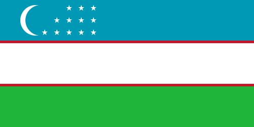
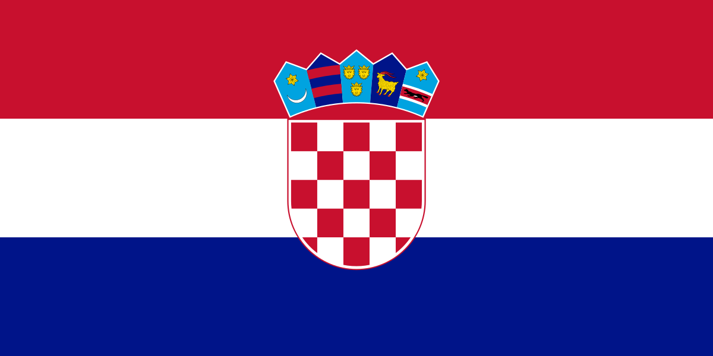
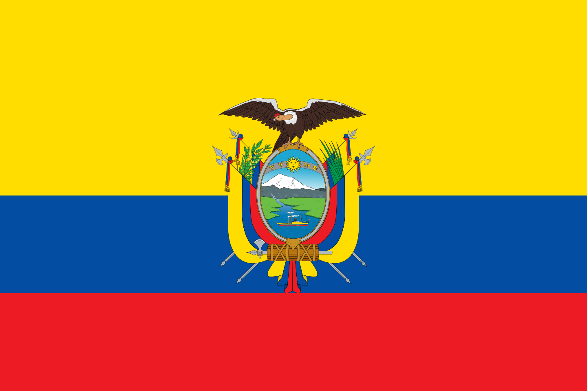
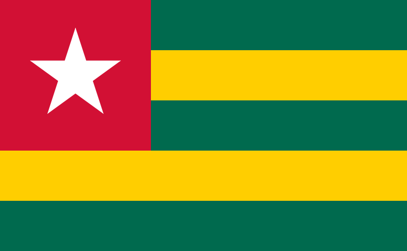

[](https://www.gnu.org/licenses/gpl-3.0.pt-br.html)

---
#### Mais de 1m Javazeiros espalhados pelo mundo [other languages](translations/Translations.md). <a href="https://dev.java/community/jugs/">Link</a>

<kbd>[](translations/README.en.md)</kbd>
<kbd>[](translations/README.al.md)</kbd>
<kbd>[](translations/README.arm.md)</kbd>
<kbd>[](translations/README.uz.md)</kbd>
<kbd>[](translations/README.aze.md)</kbd>
<kbd>[](translations/README.bn.md)</kbd>
<kbd>[](translations/README.bg.md)</kbd>
<kbd>[](README.md)</kbd>
<kbd>[](translations/README.zh-cn.md)</kbd>
<kbd>[](translations/README.cs.md)</kbd>
<kbd>[](translations/README.de.md)</kbd>
<kbd>[](translations/README.da.md)</kbd>
<kbd>[](translations/README.eg.md)</kbd>
<kbd>[](translations/README.dz.md)</kbd>
<kbd>[](translations/README.es.md)</kbd>
<kbd>[](translations/README.fr.md)</kbd>
<kbd>[](translations/README.ga.md)</kbd>
<kbd>[](translations/README.gr.md)</kbd>
<kbd>[](translations/README.ge.md)</kbd>
<kbd>[](translations/README.hu.md)</kbd>
<kbd>[](translations/README.id.md)</kbd>
<kbd>[](translations/README.hb.md)</kbd>
<kbd>[](translations/Translations.md)</kbd>
<kbd>[](translations/README.ta.md)</kbd>
<kbd>[](translations/README.fa.md)</kbd>
<kbd>[](translations/README.pus.md)</kbd>
<kbd>[](translations/README.it.md)</kbd>
<kbd>[](translations/README.ja.md)</kbd>
<kbd>[](translations/README.si.md)</kbd>
<kbd>[](translations/README.kws.md)</kbd>
<kbd>[](translations/README.ko.md)</kbd>
<kbd>[](translations/README.lt.md)</kbd>
<kbd>[ ](translations/README.ro.md)</kbd>
<kbd>[](translations/README.mm_unicode.md)</kbd>
<kbd>[](translations/README.mk.md)</kbd>
<kbd>[](translations/README.mx.md)</kbd>
<kbd>[](translations/README.my.md)</kbd>
<kbd>[](translations/README.nl.md)</kbd>
<kbd>[](translations/README.no.md)</kbd>
<kbd>[](translations/README.np.md)</kbd>
<kbd>[](translations/README.tl.md)</kbd>
<kbd>[](translations/README.ur.md)</kbd>
<kbd>[](translations/README.pl.md)</kbd>
<kbd>[](translations/README.pt-pt.md)</kbd>
<kbd>[](translations/README.ru.md)</kbd>
<kbd>[](translations/README.ar.md)</kbd>
<kbd>[](translations/README.se.md)</kbd>
<kbd>[](translations/README.slk.md)</kbd>
<kbd>[](translations/README.sl.md)</kbd>
<kbd>[](translations/README.th.md)</kbd>
<kbd>[](translations/README.tr.md)</kbd>
<kbd>[](translations/README.zh-tw.md)</kbd>
<kbd>[](translations/README.ua.md)</kbd>
<kbd>[](translations/README.vn.md)</kbd>
<kbd>[](translations/README.sw.md)</kbd>
<kbd>[](translations/README.zul.md)</kbd>
<kbd>[](translations/README.afk.md)</kbd>
<kbd>[](translations/README.igb.md)</kbd>
<kbd>[](translations/README.yor.md)</kbd>
<kbd>[](translations/README.hau.md)</kbd>
<kbd>[](translations/README.lv.md)</kbd>
<kbd>[](translations/README.fi.md)</kbd>
<kbd>[](translations/README.by.md)</kbd>
<kbd>[](translations/README.sr.md)</kbd>
<kbd>[](translations/README.kz.md)</kbd>
<kbd>[](translations/README.bih.md)</kbd>
<kbd>[](translations/README.hr.md)</kbd>
<kbd>[](translations/README.ps.md)</kbd>
<kbd>[](translations/README.so.md)</kbd>
<kbd>[](translations/README.ec.md)</kbd>
<kbd>[](translations/README.tm.md)</kbd>
<kbd>[](translations/README.ewe.md)</kbd>
<kbd>[](translations/README.et.md)</kbd>

---

<p align="center">
  
</p>

<p align="center">
  <i align="center">Web site da comunidade Java Amazonas 🚀</i>
</p>

<h4 align="center">
  <a href="https://discord.com/invite/drYCpFH75g">
    
  </a>
  <a href="https://www.youtube.com/@JavaAmazonas">
    
  </a>
</h4>

<p align="center">
    <a href="https://javaamazonas.com.br/" target="_blank"></a>
</p>


## Resources


- **[Discord](https://www.youtube.com/@JavaAmazonas)** pelo apoio e discussões com a comunidade e a equipe e eventos
- **[GitHub](https://github.com/JavaAmazonas/java-amazonas)** para código-fonte, quadro de projeto, problemas e solicitações pull.
- **[YouTube](https://www.youtube.com/@JavaAmazonas)** Canal.
- **[Whatsapp](https://chat.whatsapp.com/BwsPEqCdhw47JSKWRT6JF9)** Grupo da comunidade.
- **[Instagram](https://www.instagram.com/javaamazonas)** 
<a name="contributing_anchor"></a>


## Contributing


````
git clone https://github.com/JavaAmazonas/java-amazonas.git
````


````
npm install
````


````
ng serve 
````


Java Amazonas web é um projeto de código livre. Estamos comprometidos com um processo de desenvolvimento totalmente transparente e apreciamos muito qualquer contribuição. Esteja você nos ajudando a corrigir bugs, propondo novos recursos, melhorando nossa documentação ou divulgando - adoraríamos tê-lo como parte da comunidade Java Amazonas.  Consulte nossas... a ideia futuramente criar um blog.

- Relatório de bug: se você vir uma mensagem de erro ou encontrar um problema ao usar o site, crie um [bug report](https://github.com/JavaAmazonas/java-amazonas/issues/new?assignees=&labels=type%3A+bug&template=bug.yaml&title=%F0%9F%90%9B+Bug+Report%3A+).

- Solicitação de recurso: se você tiver uma ideia ou se faltar um recurso que tornaria o desenvolvimento mais fácil e robusto, envie uma [feature request](https://github.com/JavaAmazonas/java-amazonas/issues/new?assignees=&labels=type%3A+feature+request&template=feature.yml).


Não sabe por onde começar?  Junte-se ao nosso discord e nós o ajudaremos a começar!

<p align="center">
    <a href="https://discord.com/invite/drYCpFH75g" target="_blank"></a>
</p>

## Contributors

<!---
npx contributor-faces --exclude "*bot*" --limit 70 --repo "https://github.com/JavaAmazonas/java-amazonas"

change the height and width for each of the contributors from 80 to 50.
--->

[//]: contributor-faces


<a href="https://github.com/JavaAmazonas/java-amazonas/graphs/contributors">
  
</a>

## License


