# Translations

|                                                                                                                                                                                                                                                                             | Translated Link                                                       |
|-----------------------------------------------------------------------------------------------------------------------------------------------------------------------------------------------------------------------------------------------------------------------------|-----------------------------------------------------------------------|
|                                                                                                                                                  | [English](README.en.md)                                               |
| 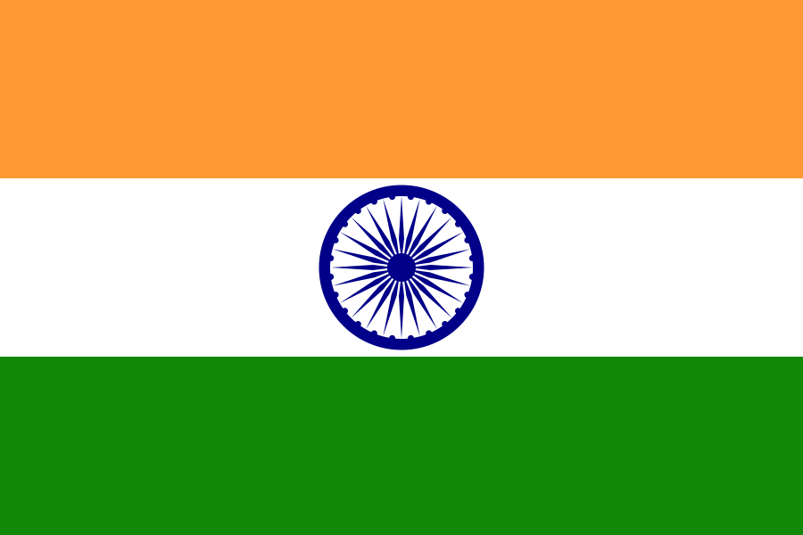                                                                                                                                                 | [ગુજરાતી](README.guj.md)                                              |
|                                                                                                                                                    | [हिन्दी](README.hi.md)                                                |
|                                                                                                                                                      | [मराठी](README.mr.md)                                                 |
|                                                                                                                                                    | [മലയാളം](README.ml.md)                                                |
|                                                                                                                                                      | [ಕನ್ನಡ](README.ka.md)                                                 |
|                                                                                                                                                    | [తెలుగు](README.te.md)                                                |
|                                                                                                                                                        | [ଓଡିଆ](README.od.md)                                                  |
|                                                                                                                                            | [छत्तीसगढ़ी](README.hne.md)                                           |
|                                                                                                                                                     | [ਪੰਜਾਬੀ](README.pb.md)                                                |
|                               | [বাংলা](README.bn.md)                                                 |
|  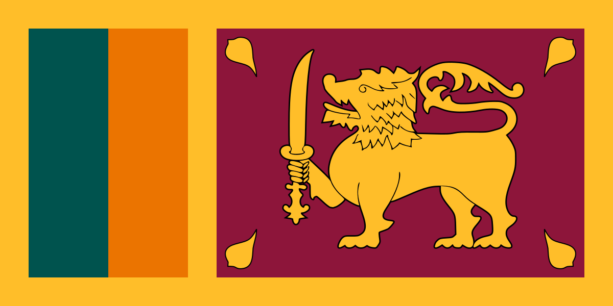                             | [தமிழ்](README.ta.md)                                                 |
|                                                                                                                                                    | [မြန်မာ](README.mm_unicode.md)                                        |
|                                                                                                                                | [Bahasa Indonesia](README.id.md)                                      |
|                                                                                                                                                | [Français](README.fr.md)                                              |
|                                                                                                                                                  | [Español](README.es.md)                                               |
|                                                                                                                                            | [Nederlands](README.nl.md)                                            |
|                                                                                                                                        | [Русский язык](README.ru.md)                                          |
| 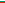                                                                                                                                             | [Bulgarian](README.bg.md)                                             |
|                                                                                                                                            | [Македонски](README.mk.md)                                            |
|                                                                                                                                                    | [Magyar](README.hu.md)                                                |
| 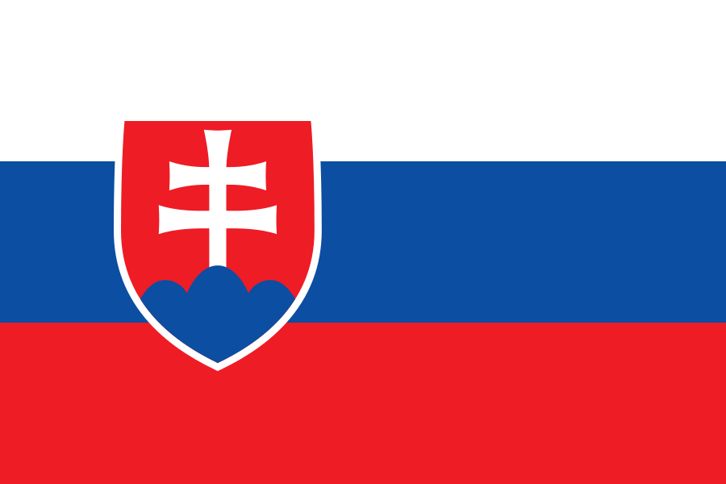                                                                                                                                           | [Slovenčina](README.slk.md)                                           |
|                                                                                                                                                          | [日本語](README.ja.md)                                                   |
|                                                                                                                                            | [Tiếng Việt](README.vn.md)                                            |
|                                                                                                                                                    | [Polski](README.pl.md)                                                |
|                                                                                                                                                      | [فارسی](README.fa.md)                                                 |
|                                                                                                                                    | [Lietuvių kalba](README.lt.md)                                        |
|                                   | [한국어](README.ko.md)                                                   |
| 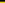                                                                                                                                                 | [Deutsch](README.de.md)                                               |
|  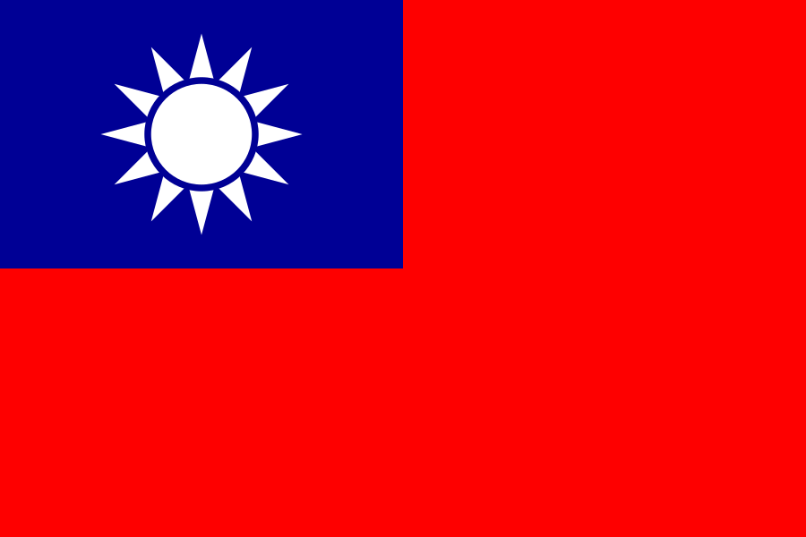                                         | [中文(Simplified)](README.zh-cn.md), [中文(Traditional)](README.zh-tw.md) |
|                                                                                                                                                | [ελληνικά](README.gr.md)                                              |
|                                                                                                                                            | [Українська](README.ua.md)                                            |
|                                                                                                                            | [Português (Brasil)](../README.md)                                 |
|                                                                                                                        | [Português (Portugal)](README.pt-pt.md)                               |
|                                                                                                                                                | [Italiano](README.it.md)                                              |
|                                                                                                                                                  | [ภาษาไทย](README.th.md)                                               |
| 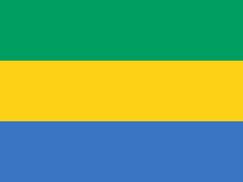                                                                                                     | [Galego](README.gl.md)                                                |
|                                                                                                                                                    | [नेपाली](README.np.md)                                                |
|                                                                                                                                                        | [اردو](README.ur.md)                                                  |
| 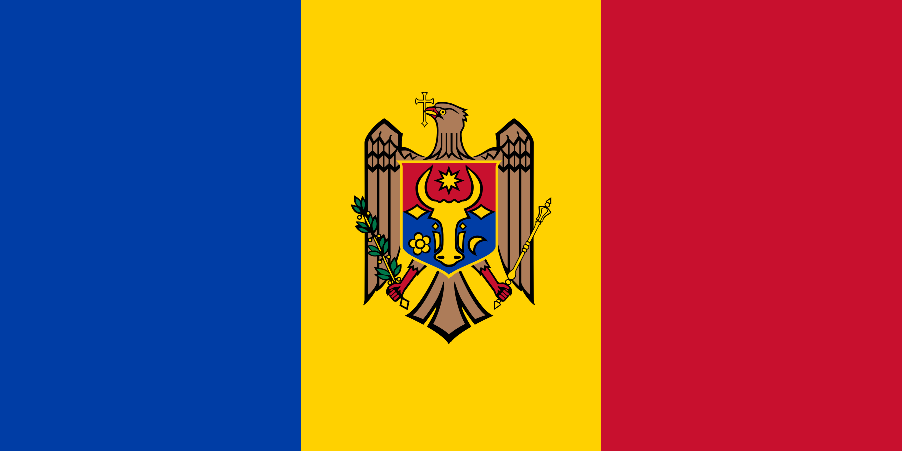  | [Limba Română](README.ro.md)                                          |
|                                                                                                                                                    | [Türkçe](README.tr.md)                                                |
|                                                                                                                                                      | [עברית](README.hb.md)                                                 |
|                                                                                          | [Bahasa Melayu / بهاس ملايو‎ / Malay](README.my.md)                   |
| 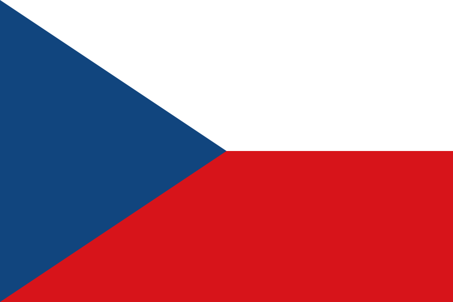                                                                                                                                                     | [Czech](README.cs.md)                                                 |
|                                                                                                                                          | [Slovenščina](README.sl.md)                                           |
|                                                                                                                                                      | [Norsk](README.no.md)                                                 |
| 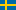                                                                                                                                                 | [Svenska](README.se.md)                                               |
| 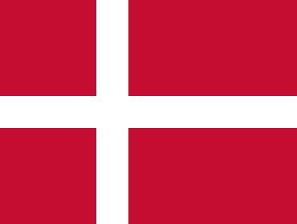                                                                                                                                                     | [Dansk](README.da.md)                                                 |
|                                                                                                                                                  | [المصرية](README.eg.md)                                               |
|                                                                                                                                  | [Wikang Filipino](README.tl.md)                                       |
| 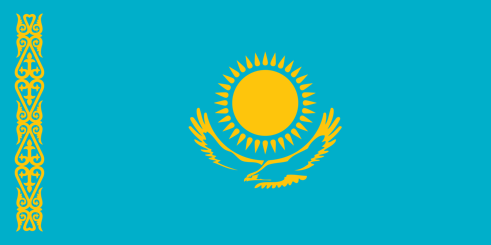                                                                                                                                                 | [Қазақша](README.kz.md)                                               |
| 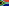                                                                                                               | [Afrikaans (South Africa)](README.afk.md)                             |
|                                                                                                                          | [Zulu (South Africa)](README.zul.md)                                  |
|                                                                                                                              | [Kiswahili (Kenya)](README.kws.md)                                    |
|                                                                                                                                                  | [ქართული](README.ge.md)                                               |
|                                                                                                                                    | [Igbo (Nigeria)](README.igb.md)                                       |
|                                                                                                                                | [Yoruba (Nigeria)](README.yor.md)
|                                                                                                                                | [Hausa (Nigeria)](README.hau.md)                                        |
|                                                                                                                                | [Pidgin (Nigeria)](README.ng-pidgin.md)                                        |
|                                                                                                                                                | [Suomeksi](README.fi.md)                                              |
| 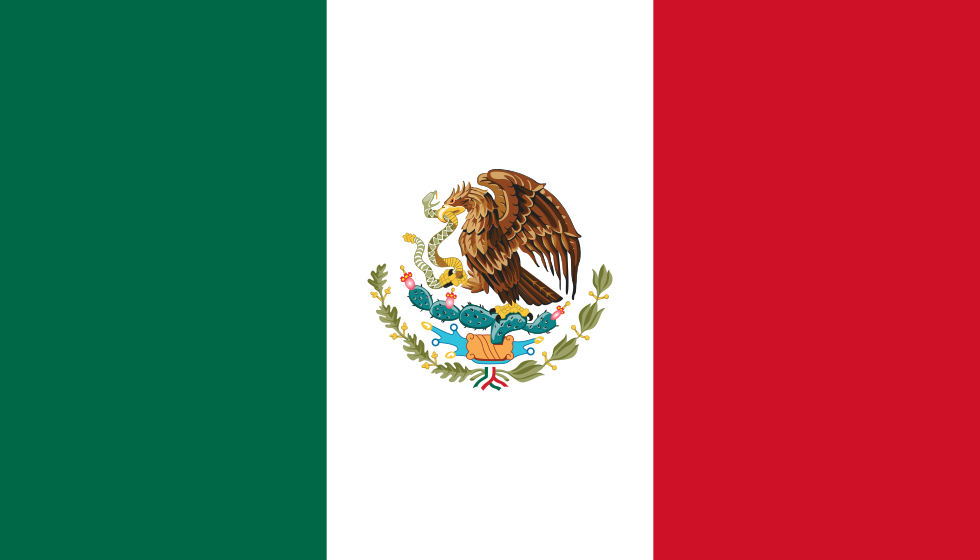                                                                                                                             | [Español de México](README.mx.md)                                     |
| 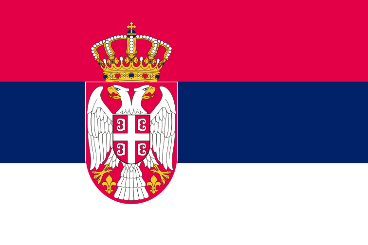                                                                                                                                                   | [Српски](README.sr.md)                                                |
|                                                                                                                                                    | [Latvia](README.lv.md)                                                |
| 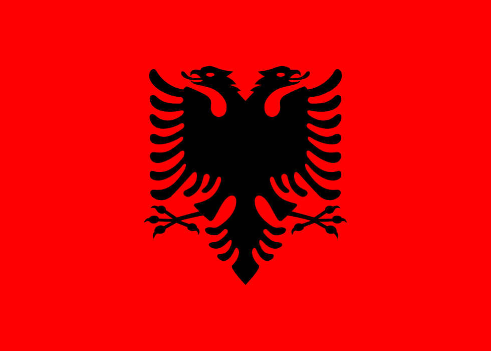                                                                                                                                                     | [Shqip](README.al.md)                                                 |
| 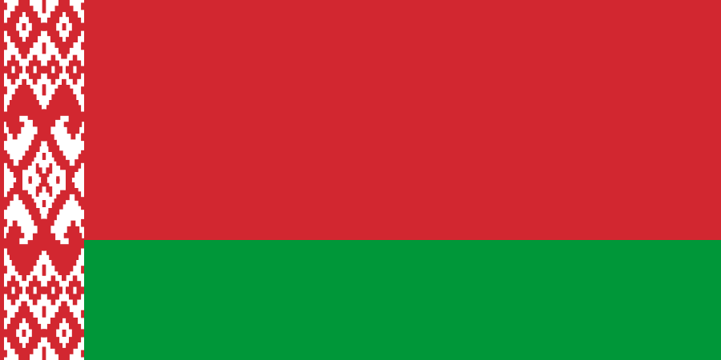                                                                                                                                | [Беларуская мова](README.by.md)                                       |
| 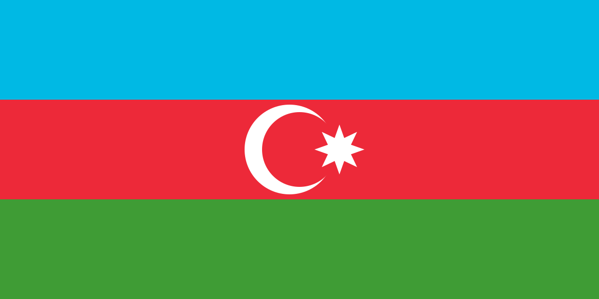                                                                                                                                                                 | [Azərbaycan dili](README.aze.md)                         |
|                                                                                                                                                | [Bosanski](README.bih.md)                                             |                           
| 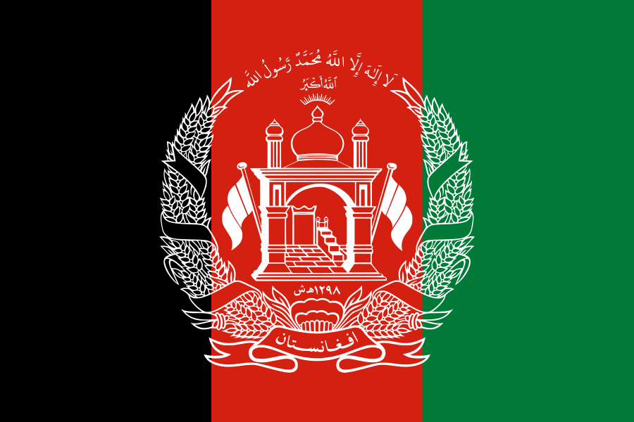                                                                                                                                                       | [پښتو - Pashto](README.ps.md)                                         |
| 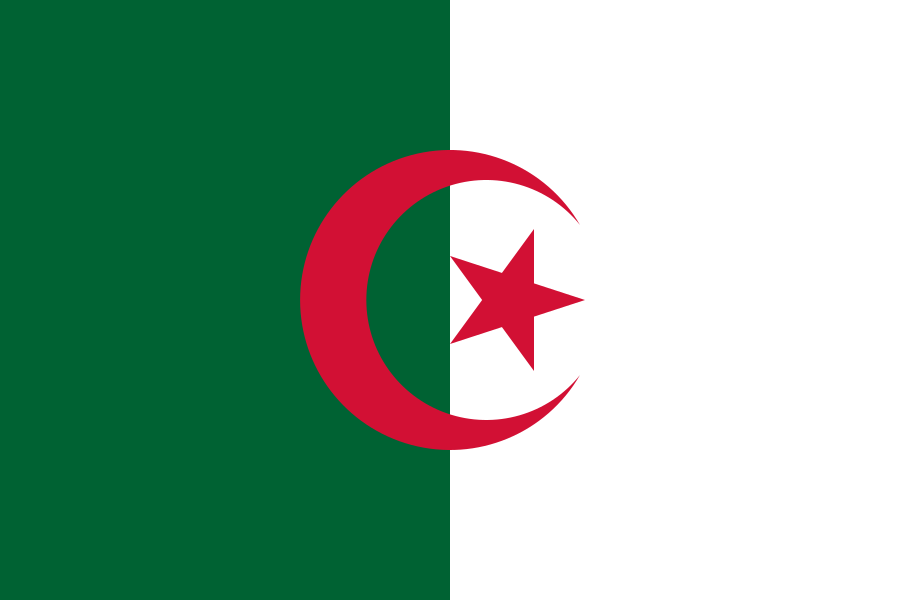                                                                                                                                        | [Dezéiriya](README.dz.md)|
| 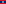                                                                                                                                                 | [ພາສາລາວ](README.la.md)                                               |
|  |[Af-soomaali](README.so.md)
|  | [සිංහල(Sri Lanka)](README.si.md)
| 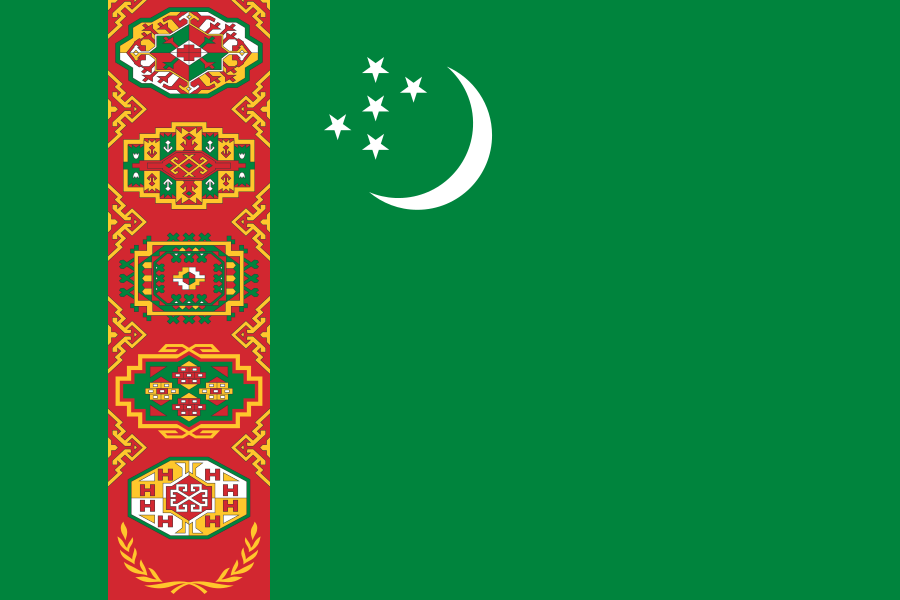                                                                                                                                                   | [Türkmençe](README.tm.md) |
|                                                                                                                                                  | [հայերեն](README.arm.md)                                                  |
| 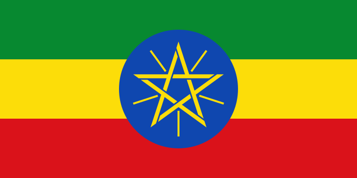                                                                                                                                         | [አማርኛ ቋንቋ](README.et.md)                           |
